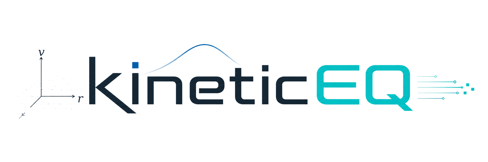

  

# kineticEQ

kineticEQ is a Python library for kinetic-equation solvers with a `Config` / `Engine` API and C++/CUDA acceleration.

---

kineticEQ は，`Config` / `Engine` API と C++/CUDA 高速化を備えた運動論方程式の数値計算ライブラリ.

## Links

- Website: https://minamium.github.io/kineticEQ/
